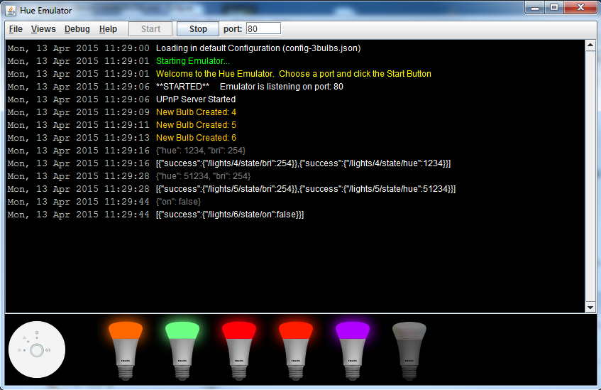

Hue-Emulator
============

The Hue Emulator is a Bridge Emulator for the Philips Hue - Personal Wireless System.  

It allows developers who don't have access to a Philips Hue system (i.e.  A Bridge + Hue Light Bulbs) to write hue apps.

For more information visit the main project page:

http://steveyo.github.io/Hue-Emulator

